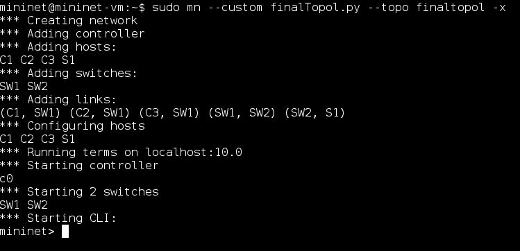

# Mini Facebook

## 1. What is it?

* An instant messaging app in virtualized network that implements a simple Facebook application using client-server model.
* The program emulates a network topology consisting of 1 server and 3 client nodes.
* Developed in Python with TCP connection.

## 2. What Can it Do?

    Mini Facebook is capable in:
    
        Profile ---------------------------------------
            Connect to server
            Ask for username/password
            Username clear text
            Password hidden text
            Login if credentials are authenticate
            Username/password hardcoded on server
            Provide a menu
            Change password
            Logout
        Communicate -----------------------------------
            Send message to another user
            See friend's online/offline status
            Unread message count
            See unread offline messages
            Real-time messages
        Activity --------------------------------------
            Send friend request
            See unread offline friend request
            Respond to friend requests
            Real-time friend request
            Accept friend request
            See friends' status updates
            Post status
            See Timeline (Wall)
            See News Feeds (last 10 updates)
        Extra -----------------------------------------
            Comment
            Like
            Number of new comments and likes
            -------------------------------------------
            
            
## 3. How to Run

* The virtualized network runs on Mininet VM.
1. On Mininet VM, run _finalTopol.py_ with the following command:\
\

2. If everything is successful, you will see this:\
\

3. Then a number of external terminals will pop open:\
![(images/clients.png)]\
These terminals are responsible for each of the nodes described in the model.

